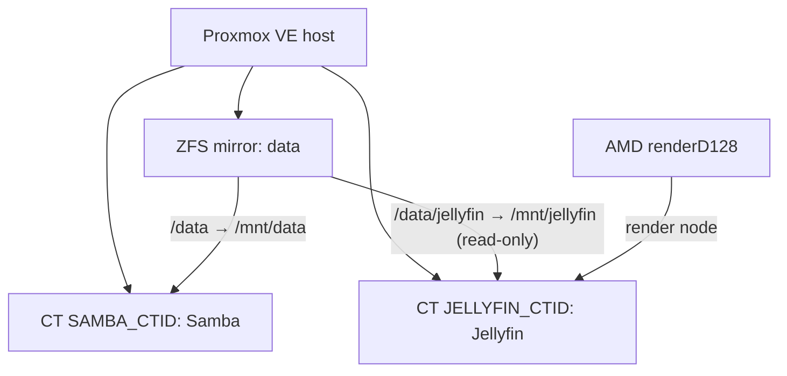

# Architecture

## Deployed topology

## Design decisions

- **One ZFS dataset:** `data` is the only dataset. Media folders are ordinary
  directories so management remains simple.
- **Unprivileged LXCs:** Samba and Jellyfin use user namespaces to reduce host
  exposure.
- **Direct media mount:** Jellyfin accesses storage through a host bind mount,
  avoiding an unnecessary SMB hop.
- **Read-only Jellyfin media:** Jellyfin cannot delete or alter the media files.
- **Native render-device mapping:** CT JELLYFIN_CTID receives only
  `/dev/dri/renderD128` for VA-API hardware acceleration.

## Boot and shutdown order

| Order | Guest | Startup delay | Shutdown behavior |
| --- | --- | --- | --- |
| 1 | CT SAMBA_CTID Samba | 20 seconds | Stops after Jellyfin |
| 2 | CT JELLYFIN_CTID Jellyfin | 20 seconds | Stops before Samba |

Proxmox starts lower order numbers first and stops guests in reverse order.
The delay sequences guest launches; it is not an application health check.
